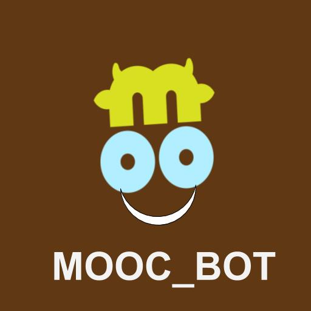

# The MOOC_BOT Engineering


The python files in this folder can deploy MOOC_BOT. It is a simple bot that answers questions about Udemy online coures. The user can ask about popular courses and ask for the bot to recommend the courses Match your search.

One important thing to note with this design is that, the data and processing is all handled in the local system. Even though we use IBM, it is used as an API service and none of the internal data is sent to IBM. This way the entire design can be implemented in your workplace without having to worry about data transfers.

The [SlackBot](https://github.com/Sundar0989/Movie_Bot/blob/master/slack/Create_slack_app.ipynb) and IBM [Watson account](https://github.com/Sundar0989/Movie_Bot/blob/master/nlp/IBM_Watson_Conversation_setup.ipynb) are built based on the Sundar0989's Tutorial. The API keys and Authorizations are in `config.py`.

### 1. `nlp_command.py`
Users can interact with MOOC_BOT via Slack. Once the user post a question, it is passed to the backend system for analysis.

**Identify Response conditions in the IBM Watson Platform:**

- Intents — What the user is trying to ask or query? 
- Dialog/Interaction — Provide the appropriate request/response for the user question.

> For instance, when the user asks:"Recommend me Udemy courses", the Intents are detected as predefined "recommend_moocs" Intent. Give the response based on the condition set in the `nlp_command.py`


### 2. `slack_command.py`

 Slack APP API engineering: includes functions that return the Slack output mainly as `attachment` method. 
 
 ```  
      slack_client.api_call(
      "chat.postMessage",
      channel= ' ',
      attachments='')   
 ```
 > `parse_bot_commands()` and `parse_direct_mention()`
 The `parse_bot_commands()` function takes events from Slack and determines if they are commands directed at Starter Bot. There are many event types that our bot will encounter, but to find commands we only want to consider message events. Message events also have subtypes, but the commands we want to find won't have any subtype defined. The function filters out uninteresting events by checking these properties. Now we know the event represents a message with some text, but we want to find out if Starter Bot is being mentioned in the text. The `parse_direct_mention() function will figure out of the message text starts with a mention, and then we compare that to the user ID we stored earlier for Starter Bot. If they are the same, then we know this is a bot command, and return the command text with the channel ID.

>`output_command`funtion
The output command is used to send the responses back to slack. This function only supports text output (slack_output). The “channel” variable is used to identify the slack channel from which the user is posting the question and use the same channel to direct the response.

 
 ### 3. `Recommender.py`
 
The content based recommender function generated in [HERE](../Code/02_Content_Based_Recommender.ipynp). With the text input in the slack bot the Recommender will give you a top 5 courses related to your search.


### 4. `chatbot_functions.py`

The dataset that processed to give a result as a Slack message. 

> For instance, `Top5_Overall` variable is the five courses that most people are subscribed to .

### 5. ` main.py`

Finally, the `main.py` is putting together all functions together to initiate the bot. 

Navigate this folder and type following command in the command line.

`python main.py`
