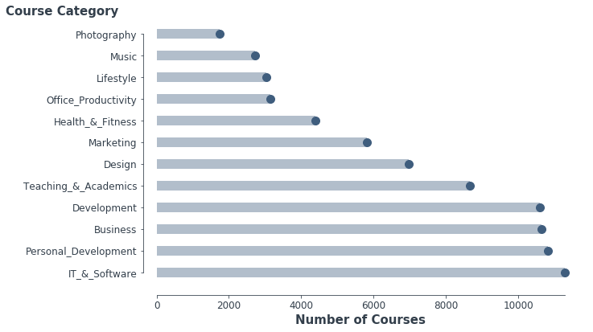
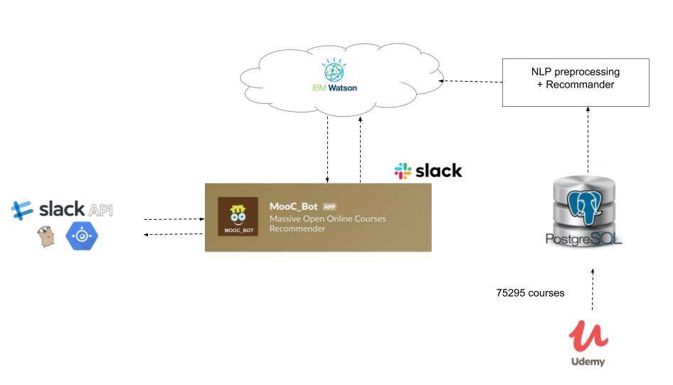

# MooC_Bot
### Slack ChatBot Course Recommender
----------
*Author: Jane Liang*

## Executive Summary

### 1. Problem Statement

MOOC (Massive Open Online Courses) is an online course with the option of free and open registration. In contrast to traditional learning courses, MOOC is aiming to provide interested learners with something they never thought possible-accessible, unlimited, and free learning. Advanced thoughts and novel ideas give great vitality to MOOC, and over 10 million users have marked in Udemy.com which is a platform of it. There is no wonder that size of the MOOC market is growing exponentially. One key challenge for Udemy.com is to reach more consumers. 

Nowadays, Chatbots are the new rage as more top brands are advancing the technology and integrating it into their chat systems. The better way for businesses to acquire customers and grow faster, is embracing chatbots. A chatbot is a little bot that runs inside a messenger (e.g., Facebook Messenger, Slack etc.) and can talk to people and get things done.The objective of this Data Science Project is to develop a chatbot system that provides various recommendations to people about Udemy online courses for helping Udemy customers to receive immediate efficiency gains and help growing Udemy Businesses. 

### 2. Data Collection

The data were collected by Udemy API, the dataset contains 75295 course information. The details are described in [here](./Data)

|Column Name|Data type|Description|
| --- | --- | --- |
|id|int|Course ID |
|avg_rating_recent|float|The average ratings for the course|
|objectives_summary|object|Objective summary of the course|
|num_subscibers|int|The number of people who subscribe the course|
|content_info|object|The Length of course or number of quiz/questions
|headline|object|The headlines of the course
|image_304x171|object|Link to the course thumbnail|
|title|object|The title of the course
|url|object|The Link to the Udemy website
|language|object|The Language that the instructor used in the course|
|category|object|The course category

### 3. EDA

#### Key findings from the EDA

- Categories of IT & Software, Personal_Development, Business, and Development have over 10000 courses. The IT & Software category has the most number of courses and the Photography category has the lease number of courses.
- 81.03% of the courses are taught in English. The third popular language is Portuguese. Other popular languages are including Spanish, Deutsch, Turkish, Japanese, French, Arabic, Russian and Chinese.
- Despite of many courses in IT and Software category, most of them are unrated. In contrast, the courses in the development courses are rated relatively high compare with other categories which have more than 10000 subscribers.
- Courses in the Development category has the most number of subscribers.
- Most courses are in a range from 0 to 25 hours, the courses in the Development category are  relatively long which is range from 0 to 50 hours. Surprisingly, there are some courses over 100 hrs.
- There's no clear linear relationship among course hours, number of subscribers and ratings.

Details can be found in [this Notebook](./Code/02_Data_Cleaning_and_EDA.ipynb)

### 4. ChatBot Workflow

Slack Technologies Inc., a business messaging provider, is the latest company to partner with International Business Machines Corp. to add artificial intelligence to its service. Slack has user-friendly ChatBot developing environment integrating with IBM's Watson, a collection of artificial-intelligence software delivered as cloud-computing services, 

Slack provides a Message Builder to define sophisticated JSON messages that include elements like buttons. Watson Conversation is a general purpose tool and doesn’t support messaging client specific functionality. In order to include the Slack message we have to put the JSON into a context attribute in a dialog node.

The details of engineering process for the MOOC_BOT can be found in [Here](./ChatBot)

### 5. ChatBot Demo

### 6. Outlook and Future Works

In this project, we're able to successfully build a Slack ChatBot that recommends Udemy courses. The MOOC_BOT can be enhanced with user's responses, the recommender system can be improved by collecting user's final decisions on the recommended courses. In the future, the MOOC_BOT has a potential to sophiscated tool as a fully conversational chatbot, recommand the courses and complete the purchasing procsses on the any messanger platform. 
